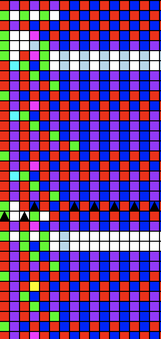

### A program that turns the Flea cellular automaton into a system of logic gates.

#### To run:
1. run `python3 Main.py`
2. type in two integers between 0 and 15 inclusive
3. watch as the system adds the numbers

#### Flea works as follows:
1. you have some number of fleas moving around on the cells of an infinite 2D grid.
2. each flea is facing a direction, and each cell is a color.
3. There is a ruleset, which maps each color to a pair of (color, angle).
4. each flea will look at the color below it. It will then paint that cell a new color, and turn a certain angle, as described in the ruleset.
5. repeat.
6. If 2 fleas are on top of each other, one will see the original color and move according to that, and the next flea will see the color that the first flea painted.

#### Notes:
This isn't exactly a cellular automaton, but it's close.

`Board.py`, `Util.py`, and `Flea.py` simulate the Flea system.

`blueprints.txt` is a file describing each of the individual 'logic gates'.
Each logic gate includes a 'power line' which transports a large number of stacked fleas up the grid for use in later gates, plus a number of inputs and outputs. Additional signals can be carried around the gate. Each gate is designed so that no matter what, all power and signal fleas pass through in the same number of steps, keeping everything synchronized.